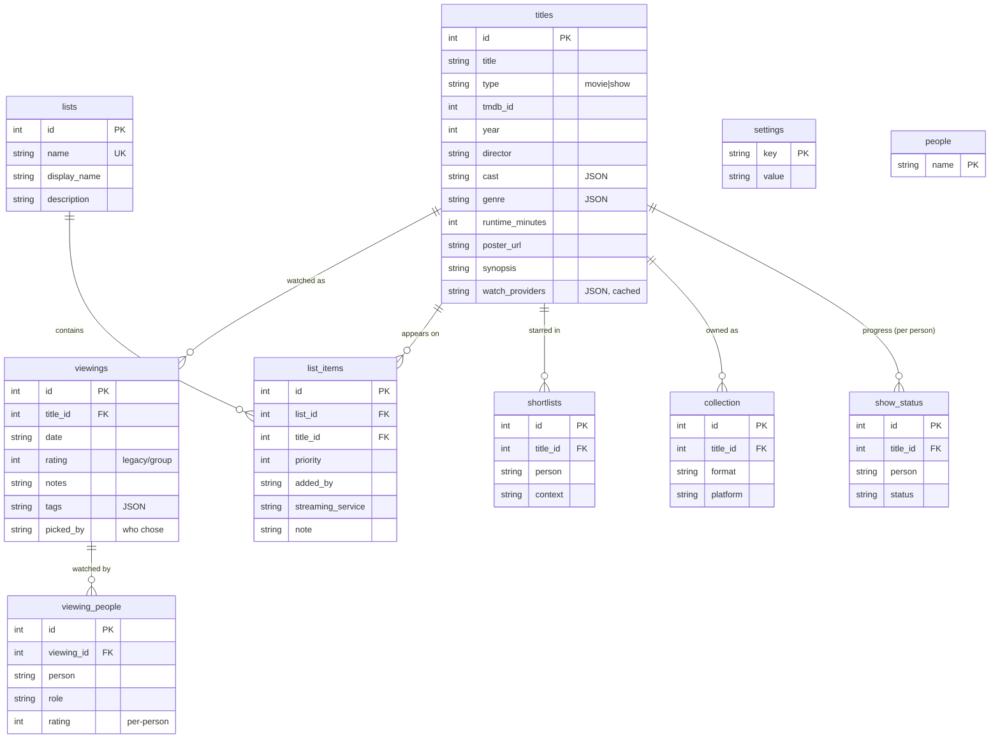

# Architecture

What To Watch Tonight is a small self-hosted web app: a React single-page app
talking to an Express + SQLite API over JSON. It's built for a household on a
home network — everyone opens it on their phone, picks "who they are" (no
passwords by default), and logs/browses what the family watches.

> This is the canonical, current design doc. For the point-in-time audit that
> drove the recent refactor, see `docs/AUDIT-*.md`.

---

## 1. System overview

```
┌──────────────────────────────────────────────────────────────┐
│  Browser — React SPA (Vite build), base path /movie-night/    │
│   Pages: Tonight · Watch Log · Search · Lists · ListDetail ·   │
│          TitleDetail · Collection · Ask (Chat)                 │
│   Global: NavBar · PersonPicker · ErrorBoundary                │
│   State:  FamilyContext (config + optional auth gate)          │
│           PersonContext (who am I)                             │
│   All network calls go through src/api.js → fetch(BASE/api/…)  │
└───────────────────────────────┬────────────────────────────────┘
                                 │ HTTP / JSON
┌───────────────────────────────┴────────────────────────────────┐
│  Express server (port 3001)                                     │
│   middleware: CORS · json(256kb) · body-string guard ·          │
│               optional shared-password auth · chat rate-limit   │
│   routes:  titles · viewings · lists · shortlists · collection  │
│            what-to-watch · family-rotation · stats · show-status│
│            tmdb (proxy) · chat (Claude)                         │
│   lib:     rotation · show-status · validate · auth · rate-limit│
│            migrate (schema runner)                              │
│   global JSON error handler + JSON 404                          │
│   (in production also serves the built client)                  │
└───────────────────────────────┬────────────────────────────────┘
                                 │
┌───────────────────────────────┴────────────────────────────────┐
│  better-sqlite3 (WAL, foreign_keys ON)                          │
│  ~/movie-night-data/movies.db  (outside the repo)               │
│  External: TMDB API (metadata/posters/providers) ·              │
│            Anthropic API (Claude Haiku chat)                    │
└─────────────────────────────────────────────────────────────────┘
```

**Production:** the built client is committed (`client/dist/`). On the Raspberry
Pi the app runs under **pm2** behind **Nginx** at `/movie-night/`. See
`docs/DEPLOYMENT.md`.

---

## 2. Tech stack

| Layer    | Tech                                                   |
| -------- | ------------------------------------------------------ |
| Frontend | React 18, Vite 5, Tailwind 3, React Router 6, @dnd-kit |
| Backend  | Node.js 20, Express 4, better-sqlite3 12               |
| AI       | @anthropic-ai/sdk (Claude Haiku)                       |
| Metadata | TMDB API                                               |
| Tests    | Node built-in test runner + supertest                  |
| Tooling  | Prettier, EditorConfig, GitHub Actions CI              |

Three `package.json` files: **root** (orchestration scripts + test deps),
**server/**, **client/**.

---

## 3. Request lifecycle & middleware

Every API request passes through, in order (`server/index.js`):

1. **CORS** — permissive by default; `CORS_ORIGIN` sets an allowlist.
2. **`express.json({ limit: '256kb' })`** — body parsing with a size cap.
3. **`limitBodyStrings`** (`lib/validate.js`) — rejects oversized string fields.
4. **`requireAuth`** (`lib/auth.js`) on `/api/*` — no-op unless `APP_PASSWORD`
   is set; then requires `x-app-password`/`Bearer`. `/health` stays open.
5. **`rateLimit`** (`lib/rate-limit.js`) on `/api/chat` — 20 req/min/IP.
6. The matching **route handler**.
7. On an unmatched `/api/*` path → **JSON 404**; on any thrown error → a
   **global JSON error handler** (never an HTML stack page).

Route handlers read the database from `req.app.locals.db`. In production that's
the real singleton; in tests it's an in-memory database (see `docs/CONTRIBUTING.md`).

---

## 4. Database schema

SQLite via better-sqlite3 (WAL mode, foreign keys on). The schema is built by a
**migration runner** (`lib/migrate.js`) from numbered, reversible migrations in
`server/migrations/`, tracked in a `schema_migrations` ledger. The same runner
is used by the server, the tests, and the seed importer — so there's one source
of truth.



Notes:

- **People are referenced by name string** (not a foreign key) from
  `viewing_people`, `shortlists`, `show_status`, `list_items.added_by`,
  `viewings.picked_by`. Identity is a free-text string everywhere.
- `genre`, `cast`, `tags` are **JSON stored in TEXT columns**, parsed in app code.
- `cast` is a SQL reserved word — quote it (`"cast"`) in expression positions.

---

## 5. API surface

| Method                   | Path                          | Purpose                                      |
| ------------------------ | ----------------------------- | -------------------------------------------- |
| GET                      | `/health`                     | Liveness (always open)                       |
| GET                      | `/api/config`                 | Family config                                |
| GET/POST/PUT             | `/api/titles[/:id]`           | Titles: search, detail, create, update       |
| GET/POST/PUT/DELETE      | `/api/viewings[/:id]`         | Watch history (+ side effects on create)     |
| GET/POST/PUT/POST/DELETE | `/api/lists/...`              | Lists, items, reorder                        |
| GET/POST/DELETE          | `/api/shortlists[/:id]`       | Per-person, per-context stars                |
| GET/POST/DELETE          | `/api/collection[/:id]`       | Owned media                                  |
| GET                      | `/api/what-to-watch/:context` | Context-filtered suggestions                 |
| GET/POST/DELETE          | `/api/family-rotation[/skip]` | Whose turn to pick                           |
| GET                      | `/api/stats`                  | Dashboard counts                             |
| GET/POST/DELETE          | `/api/show-status[/log]`      | Per-person TV progress                       |
| GET/POST                 | `/api/tmdb/...`               | TMDB proxy (search/details/providers/enrich) |
| POST                     | `/api/chat`                   | Claude assistant (rate-limited)              |

**Key side effects** (`POST /api/viewings`): logging a `family_movie_night`
viewing removes the title from the family list and advances the rotation
(`lib/rotation.js`). Marking a show `finished`/`dropped` removes it from
to-watch lists only once nobody is still `wishlist`/`watching` (`lib/show-status.js`).

---

## 6. Frontend

```
main.jsx
└── ErrorBoundary                         (catches render crashes)
    └── FamilyProvider (/api/config; auth gate; "can't reach server" retry)
        └── PersonProvider (localStorage)
            └── App (Router, base /movie-night)
                ├── pages: WhatToWatch, WatchLog, Search, Lists,
                │          ListDetail, TitleDetail, Collection, Chat
                ├── NavBar (5 tabs + PixelAvatar person button)
                └── PersonPicker (identity modal)

Shared: TitleCard, LogViewing, QuickAdd, TMDBPicker, PixelAvatar,
        ErrorState; utils.parseJSON; api() fetch wrapper (attaches auth header).
```

- **FamilyContext** loads `/api/config` once and derives members, contexts,
  list↔context maps, avatars, streaming IDs. Shows a password gate on 401 and a
  retry screen if the server is unreachable.
- **PersonContext** holds the current person in `localStorage`.

---

## 7. External integrations & configuration

- **TMDB** (`routes/tmdb.js`) — API key in query string; parallel movie+tv
  search; watch providers cached onto the title row (region CA).
- **Anthropic** (`routes/chat.js`) — Claude Haiku, system prompt from family
  config, ~11 read/write DB tools, agentic loop capped at 5 iterations,
  rate-limited.
- **`family.config.json`** — the personalization heart: members (+ pixel-avatar
  grids), guests, rotation order, contexts→lists, list defs, subscribed
  streaming-service IDs, and the watch-providers region (`watchProvidersRegion`,
  default `CA`). `family.config.example.json` is the public template.
- **Env** (`.env`): `TMDB_API_KEY`, `ANTHROPIC_API_KEY`, optional `PORT`,
  `DB_PATH`, `APP_PASSWORD`, `CORS_ORIGIN`.

---

## 8. Key design decisions

- **SQLite over a server DB** — single file suits a family app on a Pi; WAL gives
  enough concurrency for a handful of users.
- **DB injected via `app.locals.db`** — so tests run the real route handlers
  against an in-memory database.
- **Optional auth, off by default** — zero friction on a trusted LAN; a single
  shared password is available for anyone exposing the app more widely.
- **Parameterized SQL everywhere** — no string interpolation of user values.
