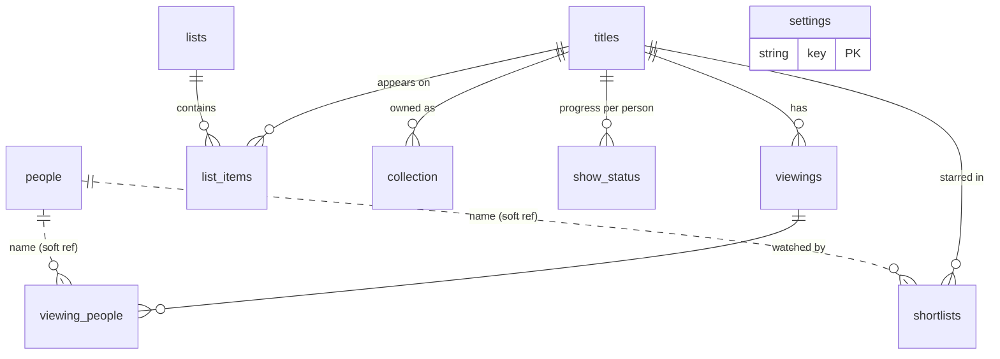

# Audit — Architecture (Phase 1)

**Date:** 2026-05-30
**Author:** Claude (Opus 4.8), full read-through of source, docs, tests, git history, and the database.
**Scope:** "What To Watch Tonight" — family movie/TV tracking web app, as it actually exists today.

> **⚠️ Correction (2026-05-30, post-review).** The "live database" numbers originally in this audit were read from the **stale dev copy on the Mac** (`~/movie-night-data/movies.db`, last modified 2026-05-20, newest viewing F1 on 2026-03-14). The **real production database is on the Raspberry Pi** and is well ahead of it. Figures below have been corrected against the live Pi DB. The most important correction: `viewings.picked_by` is **populated on 21 viewings** (every viewing logged through the app since the feature shipped), **not 0** — the rotation feature works correctly in production. See §7.

This document is descriptive (what _is_), not prescriptive. Findings, opinions, and recommendations live in the three companion documents:

- `AUDIT-UX.md` — user-experience gap analysis
- `AUDIT-TECH-DEBT.md` — code/architecture/security/perf/testing audit
- `AUDIT-RECOMMENDATION.md` — refactor-vs-rebuild call and action plan

---

## 1. System Overview

A single-page React app talking to an Express + SQLite API over JSON. Designed for a home LAN: every family member opens it on their phone, picks "who they are" (no passwords), and logs/browses what the household watches.

```
┌──────────────────────────────────────────────────────────────┐
│  Browser — React SPA (Vite build), base path /movie-night/    │
│                                                                │
│   Pages: Tonight · Watch Log · Search · Lists · ListDetail ·   │
│          TitleDetail · Collection · Ask(Chat)                  │
│   Global: NavBar (bottom tabs) · PersonPicker (identity modal) │
│   State:  FamilyContext (config) · PersonContext (who am I)    │
│                                                                │
│        all network calls go through src/api.js                 │
│        → fetch(`${BASE_URL}/api/...`)                          │
└───────────────────────────────┬────────────────────────────────┘
                                 │ HTTP / JSON
┌───────────────────────────────┴────────────────────────────────┐
│  Express server (port 3001)                                     │
│   /api/config            family config (read-only)              │
│   /api/titles            CRUD + search                          │
│   /api/viewings          watch history + side effects           │
│   /api/lists             watchlists, items, reorder, create     │
│   /api/shortlists        per-person, per-context stars          │
│   /api/collection        physical/digital media                 │
│   /api/what-to-watch     context-filtered suggestions           │
│   /api/family-rotation   whose turn to pick                     │
│   /api/stats             dashboard counts                       │
│   /api/show-status       per-person TV progress + show log      │
│   /api/tmdb              TMDB proxy (search/details/providers)   │
│   /api/chat              Claude Haiku assistant (tool use)       │
│                                                                 │
│   In production also serves client/dist/ static assets.         │
└───────────────────────────────┬────────────────────────────────┘
                                 │
┌───────────────────────────────┴────────────────────────────────┐
│  better-sqlite3 (WAL, foreign_keys ON)                          │
│  ~/movie-night-data/movies.db   (outside the repo)              │
│                                                                 │
│  External: TMDB API (metadata, posters, watch providers)        │
│            Anthropic API (Claude Haiku chat)                    │
└─────────────────────────────────────────────────────────────────┘
```

**Production topology:** the built client is committed to git (`client/dist/`). On the Raspberry Pi ("anguspi") the app runs under **pm2** (`ecosystem.config.js`, process name `movie-night`, `NODE_ENV=production`, port 3001) behind **Nginx** at `http://anguspi.local/movie-night/`. (**Verified on the live Pi 2026-05-30:** `nginx` is the active service on :80; `caddy` is inactive. The audit brief's mention of _Caddy_ was incorrect — it's Nginx, as the repo docs say.)

---

## 2. Tech Stack (with versions)

| Layer              | Technology                                                 | Declared version                                  |
| ------------------ | ---------------------------------------------------------- | ------------------------------------------------- |
| Frontend framework | React                                                      | ^18.3.1                                           |
| Build tool         | Vite                                                       | ^5.2.11                                           |
| Routing            | react-router-dom                                           | ^6.23.1                                           |
| Styling            | Tailwind CSS                                               | ^3.4.3 (+ postcss ^8.4.38, autoprefixer ^10.4.19) |
| Drag & drop        | @dnd-kit/core ^6.3.1, /sortable ^10.0.0, /utilities ^3.2.2 |
| Backend runtime    | Node.js                                                    | (local: v24.x)                                    |
| Web framework      | Express                                                    | ^4.22.1                                           |
| Database driver    | better-sqlite3                                             | ^12.6.2                                           |
| Env loading        | dotenv                                                     | server ^16.6.1 / root ^17.3.1                     |
| CORS               | cors                                                       | ^2.8.6                                            |
| AI                 | @anthropic-ai/sdk                                          | ^0.78.0 (model `claude-haiku-4-5-20251001`)       |
| Dev: server reload | nodemon                                                    | ^3.1.14                                           |
| Dev: run both      | concurrently                                               | ^8.2.2                                            |
| Tests              | `node --test` (built-in)                                   | —                                                 |

There is **no TypeScript**, no linter (ESLint/Prettier) config, and no CI configuration in the repo. Tests use Node's built-in test runner only.

**Three package.json files:**

- **root** — orchestration scripts (`dev`, `build`, `deploy`, `import`, `enrich`, `test`); deps `better-sqlite3`, `dotenv` (used by seed/enrichment scripts).
- **server/** — `express`, `better-sqlite3`, `cors`, `dotenv`, `@anthropic-ai/sdk`; dev `nodemon`.
- **client/** — React, Vite, Tailwind, dnd-kit, react-router.

`better-sqlite3` is therefore installed in two trees (root + server).

---

## 3. Database Schema (as-is)

The base schema lives in `server/migrations/001_initial.sql`. **Several columns and two whole tables are added by inline "incremental migrations" in `server/db.js`, not in the SQL file** — so the `.sql` file alone does not describe the real schema. The **live production database (Pi)** currently has:

| Table            | Rows (live Pi) | Purpose                                                                                                                                                    |
| ---------------- | -------------: | ---------------------------------------------------------------------------------------------------------------------------------------------------------- |
| `titles`         |            741 | Movies & shows.                                                                                                                                            |
| `viewings`       |            528 | One row per watch event. **21 rows have `picked_by` set** (all app-logged viewings since the feature shipped; older seed-imported viewings don't). See §7. |
| `viewing_people` |            790 | People linked to a viewing, with `role` (656 'chooser' / 134 'viewer') and per-person `rating`.                                                            |
| `lists`          |             13 | Named watchlists (4 created in-app beyond the original 9).                                                                                                 |
| `list_items`     |            270 | Title↔list membership, with `priority`, `added_by`, `streaming_service`, `note`.                                                                           |
| `people`         |              5 | Family members + guests (seeded from config).                                                                                                              |
| `settings`       |              1 | Key/value; holds `family_rotation_next`.                                                                                                                   |
| `shortlists`     |              7 | Per-person, per-context "stars". Genuinely lightly used.                                                                                                   |
| `collection`     |             72 | Owned media (dvd/bluray/digital).                                                                                                                          |
| `show_status`    |             12 | Per-person TV progress — **actively used** (6 finished, 6 watching), not "barely used" as an earlier draft of this audit claimed from a stale DB.          |

_(All counts above are now exact from the live production Pi DB, 2026-05-30. `titles` = 741, 690 movies / 51 shows, 706 with a `tmdb_id`, 700 with a poster.)_

### Columns

`titles`: `id, title, title_raw, type('movie'|'show'), tmdb_id, year, director, cast(JSON), genre(JSON), runtime_minutes, poster_url, synopsis, created_at, updated_at` **+ (added in db.js)** `watch_providers(JSON), watch_providers_updated_at`.

`viewings`: `id, title_id→titles, date(TEXT), date_precision, rating, notes, tags(JSON), created_at` **+** `picked_by(TEXT)`.

`viewing_people`: `id, viewing_id→viewings, person, role(default 'chooser')` **+** `rating(INTEGER)`.

`lists`: `id, name(UNIQUE), display_name, description`.

`list_items`: `id, list_id→lists, title_id→titles, streaming_service, source, note, priority, added_at, UNIQUE(list_id,title_id)` **+** `added_by(TEXT)`.

`people`: `name(PK), display_name, aliases(JSON)`.

`settings`: `key(PK), value, updated_at`.

`shortlists`: `id, title_id→titles, person, context, created_at, UNIQUE(title_id,person,context)`.

`collection` _(db.js)_: `id, title_id→titles, format, platform, notes, added_at, UNIQUE(title_id,format)`.

`show_status` _(db.js)_: `id, title_id→titles, person, status CHECK(wishlist|watching|finished|dropped), started_date, ended_date, notes, updated_at, UNIQUE(title_id,person)`.

### Indexes (live)

`viewings(title_id)`, `viewings(date)`, `viewing_people(viewing_id)`, `list_items(list_id)`, `list_items(title_id)`, `shortlists(context)`, `collection(title_id)`, `show_status(title_id)`, `show_status(person)`.

### Schema notes

- `genre`, `cast`, `tags` are **JSON strings inside TEXT columns**, parsed in app code (and occasionally `LIKE`-matched in SQL).
- `cast` is a SQL reserved word, used unquoted in several queries (works in SQLite, fragile).
- Foreign keys are declared and `PRAGMA foreign_keys = ON`, but there are **no `ON DELETE` cascade rules** — deletes are handled manually in route code (e.g. deleting a viewing deletes its `viewing_people` first).
- There is no index on `viewing_people(person)` despite person-filtered queries.

### ER (Mermaid)



`people` is referenced **by name string**, not by foreign key, from `viewing_people`, `shortlists`, `show_status`, `list_items.added_by`, and `viewings.picked_by`. Person identity is a free-text string everywhere.

---

## 4. API Surface

All mounted in `server/index.js`. Conventions: JSON in/out; success returns the affected row(s) or `{success:true}`; validation failures return `4xx` with `{error}`.

| Method | Path                                 | Notes                                                                                                                                                              |
| ------ | ------------------------------------ | ------------------------------------------------------------------------------------------------------------------------------------------------------------------ |
| GET    | `/health`                            | `{status:'ok'}`                                                                                                                                                    |
| GET    | `/api/config`                        | Full family config JSON                                                                                                                                            |
| GET    | `/api/titles`                        | `?q,type,page,limit`; search title/director/cast/synopsis                                                                                                          |
| GET    | `/api/titles/:id`                    | Title + viewings + listMemberships + collection + shortlists                                                                                                       |
| POST   | `/api/titles`                        | Create (title required)                                                                                                                                            |
| PUT    | `/api/titles/:id`                    | COALESCE update                                                                                                                                                    |
| GET    | `/api/viewings`                      | Rich filtering: person/from/to/min-maxRating/tags/search/hasNotes/sort/type/paged                                                                                  |
| POST   | `/api/viewings`                      | Create; **side effects**: removes from `family_to_watch` + advances rotation if `family_movie_night` tag; sets `added_by` on family list item if `picked_by` given |
| PUT    | `/api/viewings/:id`                  | Update; replaces `viewing_people` if `people` provided                                                                                                             |
| DELETE | `/api/viewings/:id`                  | Deletes people then viewing                                                                                                                                        |
| GET    | `/api/lists`                         | All lists with item counts                                                                                                                                         |
| POST   | `/api/lists`                         | Create list (name sanitised)                                                                                                                                       |
| GET    | `/api/lists/:name/items`             | Items with metadata + aggregate rating                                                                                                                             |
| POST   | `/api/lists/:name/items`             | Add item (UNIQUE → 409)                                                                                                                                            |
| PUT    | `/api/lists/:name/items/:itemId`     | Update item fields                                                                                                                                                 |
| POST   | `/api/lists/:name/items/reorder`     | Bulk priority update in a transaction                                                                                                                              |
| DELETE | `/api/lists/:name/items/:itemId`     | Remove item                                                                                                                                                        |
| GET    | `/api/shortlists`                    | `?context=` required; grouped by title                                                                                                                             |
| POST   | `/api/shortlists`                    | Toggle (add/remove) by (title,person,context)                                                                                                                      |
| DELETE | `/api/shortlists/:id`                |                                                                                                                                                                    |
| GET    | `/api/collection`                    | All entries + title info                                                                                                                                           |
| GET    | `/api/collection/title/:titleId`     | Entries for one title                                                                                                                                              |
| POST   | `/api/collection`                    | Add (format in dvd/bluray/digital; UNIQUE → 409)                                                                                                                   |
| DELETE | `/api/collection/:id`                |                                                                                                                                                                    |
| GET    | `/api/what-to-watch/:context`        | Context→lists; family excludes last-12-month watches; inlines shortlist + collection                                                                               |
| GET    | `/api/family-rotation`               | `{nextChooser, rotation, lastChooser, skipped}` from `settings`                                                                                                    |
| POST   | `/api/family-rotation/skip`          | Advance one                                                                                                                                                        |
| DELETE | `/api/family-rotation/skip`          | Undo skip (back one)                                                                                                                                               |
| GET    | `/api/stats`                         | totals + 5 recent                                                                                                                                                  |
| GET    | `/api/show-status`                   | `?title_id=` statuses                                                                                                                                              |
| POST   | `/api/show-status`                   | Upsert; **finished/dropped → deletes title from ALL lists**                                                                                                        |
| DELETE | `/api/show-status`                   | Clear a person's status                                                                                                                                            |
| GET    | `/api/show-status/log`               | Shows grouped, with per-person statuses, paged                                                                                                                     |
| GET    | `/api/tmdb/search`                   | `?q,type=movie\|tv\|multi`; multi runs parallel movie+tv                                                                                                           |
| GET    | `/api/tmdb/movie/:id` / `/tv/:id`    | Details + credits                                                                                                                                                  |
| POST   | `/api/tmdb/enrich/:titleId`          | Search/fetch TMDB → write metadata onto title                                                                                                                      |
| GET    | `/api/tmdb/watch-providers/:titleId` | CA providers, cached on the title row; `?refresh=true`                                                                                                             |
| POST   | `/api/chat`                          | Claude Haiku agentic loop (≤5 iters), 11 DB tools                                                                                                                  |

---

## 5. Frontend Component Tree

```
main.jsx
└── FamilyProvider (GET /api/config; renders null until loaded)
    └── PersonProvider (localStorage 'movie-night-person')
        └── App (BrowserRouter basename=/movie-night)
            ├── Routes
            │   ├── /            WhatToWatch   (726 lines)
            │   ├── /log         WatchLog      (movies | shows tabs)
            │   ├── /search      Search
            │   ├── /lists       Lists         (+ create-list modal, Collection card)
            │   ├── /lists/:name ListDetail
            │   ├── /title/:id   TitleDetail   (1094 lines — largest file)
            │   ├── /collection  Collection
            │   └── /chat        Chat (Ask)
            ├── NavBar           (5 tabs + PixelAvatar person button)
            └── PersonPicker     (full-screen identity modal)

Shared components:
  TitleCard      → ListDetail
  LogViewing     → WhatToWatch, WatchLog, TitleDetail
  QuickAdd       → WhatToWatch, Lists, ListDetail
  TMDBPicker     → TitleDetail
  PixelAvatar    → NavBar, PersonPicker   (NOW integrated — older docs say otherwise)

Local sub-components defined inline:
  WhatToWatch:   SwipeToRemove, ShortlistButton, WatchCard, RotationBadge
  TitleDetail:   ViewingItem, EditableTitle, AddToListSheet, AddToCollectionForm
  WatchLog:      ViewingRow, ShowRow
  Chat:          MessageContent (+ parseContent)
```

**Client utilities:** `api.js` (fetch wrapper that throws on non-OK and extracts `{error}`), `utils.js` (`parseJSON` safe parse).

**Contexts:**

- `FamilyContext` — loads `/api/config` once; derives `memberNames`, `allPeople`, `contextListMap`, `listToContext`, avatar/color lookups, `streamingServiceIds` (Set).
- `PersonContext` — current person in `localStorage`; controls PersonPicker visibility.

---

## 6. External Integrations & Config

- **TMDB** (`server/routes/tmdb.js`) — v3 API key in query string (`TMDB_API_KEY`). Used for search (parallel movie+tv for `multi`), details+credits, and watch providers (region hardcoded **CA**), cached onto the title row. Image URLs built client-side from `image.tmdb.org`.
- **Anthropic** (`server/routes/chat.js`) — `@anthropic-ai/sdk`, model `claude-haiku-4-5-20251001`, system prompt built from family config, 11 read/write DB tools, agentic loop capped at 5 iterations, last-40-message trim. `dotenv` loaded with `override:true` (Claude Code sets an empty env var otherwise).
- **family.config.json** — the heart of personalization: members (with pixel-avatar grids + colors), guests, rotation order, contexts→lists mapping, list definitions, and `streamingServiceIds` (TMDB provider IDs the household subscribes to). Loaded at server start into `app.locals`; `family.config.example.json` is the public template. The real file is git-ignored.
- **Env** (`.env`): `TMDB_API_KEY`, `ANTHROPIC_API_KEY`, optional `PORT`, `DB_PATH`.

---

## 7. Notable Runtime State (grounded in the live Pi DB)

- **`viewings.picked_by` works and is set on 21 viewings.** Every viewing logged through the app since the feature shipped has it (e.g. _Arrival_, 2026-05-29, `picked_by='Gordon'`, which correctly advanced rotation to Davin). The ~500 older **seed-imported** viewings lack it because the importer never set it. The **Tonight tab** advances rotation correctly via the `settings.family_rotation_next` counter (the "tough luck" rule — advance on any `family_movie_night` viewing).
- **The chat assistant computes rotation from a _different, unreliable_ source.** `routes/chat.js → toolGetFamilyRotation` reads the last `viewing_people` row with `role='chooser'` — but the Log form inserts **every attendee** as `role='chooser'` (the live DB has 656 'chooser' rows vs 134 'viewer'; _Arrival_ lists all four family members as 'chooser'). So "who chose last" via that path is effectively arbitrary. It also references a `family_rotation_next_override` settings key that **no code ever writes**. Result: the **Ask** tab can give a different rotation answer than the **Tonight** badge. This divergence — not `picked_by` — is the real defect. (Detailed in `AUDIT-TECH-DEBT.md`.)
- **Shortlists are lightly used (7 rows); show_status is actively used (12 rows — 6 finished, 6 watching).** This matters: the "finished/dropped removes the show from _every_ list" behaviour (see `AUDIT-TECH-DEBT.md` / `AUDIT-UX.md`) operates on a feature people actually use, so it has likely already affected shared lists. Treat that fix as higher priority than a "lightly used" framing would suggest.

---

## 8. Documentation Inventory & Quality

| Doc                                                | Role                              | State                                                                                                         |
| -------------------------------------------------- | --------------------------------- | ------------------------------------------------------------------------------------------------------------- |
| `README.md`                                        | Public overview, features, setup  | Good, current, public-ready tone                                                                              |
| `ARCHITECTURE.md` (root)                           | System + module responsibilities  | Good and mostly accurate                                                                                      |
| `AUDIT.md` (root)                                  | Prior codebase audit (2026-03-28) | **Stale** — lists bugs as open that `KNOWN-ISSUES.md` marks resolved                                          |
| `KNOWN-ISSUES.md`                                  | Resolved + open issues            | Current (2026-05-30), useful                                                                                  |
| `CONTRIBUTING.md`                                  | "Golden rules" / workflow         | Aspirational; describes practices (JSDoc on all fns, constants file, debug flag) the code only partly follows |
| `DEPLOY_MOVIE_NIGHT.md`                            | Pi/pm2/Nginx deploy               | Current; Nginx (not Caddy)                                                                                    |
| `QA-CHECKLIST.md`                                  | Manual QA list                    | Present                                                                                                       |
| `code-review-qa-prompt.md`                         | Prompt scaffolding                | Process artifact, not product doc                                                                             |
| `ANGUSPI_OPERATIONS.md`, `PI_FRESH_SETUP_GUIDE.md` | Symlinks to shared Pi docs        | External                                                                                                      |

**Overall:** documentation is unusually _abundant_ for a hobby project, but **fragmented and partially contradictory**. There are effectively three overlapping architecture/audit/issue docs (`ARCHITECTURE.md`, `AUDIT.md`, `KNOWN-ISSUES.md`) plus this new `docs/` set. For a public release, this needs consolidation into a single canonical `docs/` tree (addressed in the recommendation).

---

## 9. Tests

`tests/*.test.js`, run via `npm test` (`node --test`). **89 tests, all passing.** Suites cover: titles, viewings, viewing side-effects, lists (incl. create), collection, shortlists (incl. the known context-mismatch bug), rotation, show-status, what-to-watch.

**Critical structural caveat:** the tests **do not import or exercise the Express route handlers.** They spin up an in-memory SQLite DB and **re-implement the SQL queries inline** inside the test file (see `what-to-watch.test.js`, which redeclares the query). They validate schema behaviour and query logic, but not the actual route code, its validation, error handling, or HTTP contract. This is expanded in `AUDIT-TECH-DEBT.md`.

---

## 10. One-paragraph summary

This is a genuinely capable, feature-rich family app with a clean, conventional architecture: a thin React SPA, a flat set of Express route modules, and a single SQLite file. The data model is sensible and the separation of concerns is mostly good. The rough edges are concentrated in (a) features that grew organically and now have _two_ implementations or stale data paths — rotation above all; (b) a test suite that proves the SQL but not the server; (c) cross-cutting gaps (no global error handling, no input limits, LAN-only security assumptions) that are fine for a Pi but matter for the stated ambition of a public, self-hostable, eventually-mobile product. Details and a refactor-vs-rebuild verdict follow in the companion docs.
